# Film Review Blog

My Film Review is a blog bringing you fresh and original views of different genres of films. This web application allows users to register an account, login, and comment on reviews.

This blog was created using Django and has full CRUD functionality with an intuitive User Interface to make interactions with posts and other users simple and fun!

<!--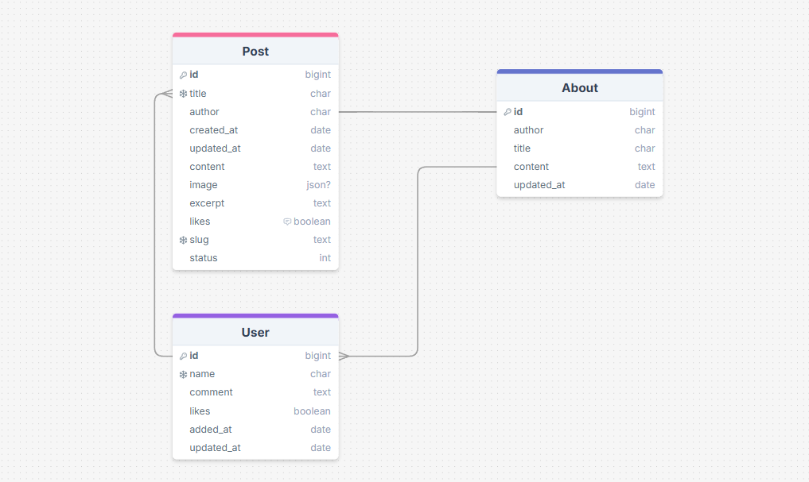 -->

- [Live Site](https://my-film-blog-pp4-d9dc642517af.herokuapp.com/)

## Table of Contents

1. [UX](#ux)
2. [Features](#features)
3. [Future Features](#future-features)
4. [Technologies](#technologies)
5. [Testing](#testing)
6. [Bugs](#bugs)
7. [Deployment](#deployment)
8. [Credits](#credits)
9. [Acknowledgements](#acknowledgements)

## UX

## Project Planning

This project was born from a deep interest in storytelling and cinematic creativity, with a particular focus on plot development. It evolved into a Django-powered film review blog designed to deliver a clean, responsive user experience while showcasing best practices in web development. From dynamic content rendering to modular templating with Python and HTML, the platform reflects my ability to build scalable, maintainable applications that balance creative expression with technical precision.

This blog was created following the Five Planes of Website Design, ensuring a thoughtful balance between strategy, scope, structure, skeleton, and surface. The project was driven by four key ojectives:

- Deliver a clean, responsive interface for browsing and reviewing films.
- Establish a scalable architecture supporting full CRUD operations.
- Integrate intuitive search functionality to streamline content discovery.
- Build a reusable base layout with modular templates for easy extension and maintainability.

## [Strategy](#strategy)
### User

As a user, I want to modify or delete comments previously left on posts.

As a user, I want to know what films are yet to be released and their release date.

As a user, I want to be able to search for a specific film review and view comments from other visitors.

As a user, I want to interact with both film reviews from the author and comments from other visitors.

As a user, I want to be able to read about the owner of the blog so that I can find out more about them.

As a user, I want to be able to customise my experience of the blog by requesting a review of specific films.

As a user, I want to be presented with a punchy but well presented list of films, so that I can choose the reviews I want to read in more detail.

### Site Admin
 
As a site admin, I want to be able to create a draft, then finish and post at a later stage.

As a super user, I want to be able to create film review posts using a user-friendly interface.

As a site owner, I want to be able to convey my passion for films and plots through my Blogsite.

As a super user, I want to be able to monitor user comments with full Create, Read, Update, and Delete (CRUD) functionality.

As a site owner, I want to be able to interact and connect with users, producing relevant content by accepting requests for films to review.

[Back to Top](#ux)

## [Scope](scope)
The blogsite should have a navigation menu that is consistent across all pages and devices.

The blogsite should have clear messaging to users explaining what the blog is about and the why of the owner.

The blogsite should provide a succint list of reviewed films at first glance, allowing the user to click for more detail.

The blogsite should promote engagement and collaboration through functionality to leave comments and likes on film reviews.

The blogsite should enhance engagement and collaboration through functionality to receive requests for films to review from users.

The blogsite should provide the user with a way to get in touch directly and explore other passions, interests and hobbies of the owner.

[Back to Top](#ux)

## [Structure](structure)
This Django project consists of:

**Apps** - Core <code>review</code> app for handling posts, search functionality, and rendering primary pages and <code>about</code> app for informative purposes.

**Templates** - Modular templates for reusable layouts <code>base.html</code> <code>index.html</code> <code>post_detail.html</code> <code>search_results.html</code> <code>about.html</code>.

**Models** - Basic <code>Post</code> model for storing film reviews with fields like <code>title</code> <code>slug</code> <code>body</code> <code>created</code>.

**URLs** - Routed with <code>urls.py</code> using meaningful patterns like <code>post/<'slug:slug'>/</code> and <code>search/</code>.

**Views** - Handles logic for rendering page details with <code>views.py</code> and search queries with dynamic responses.

**Bootstrap4** - For responsive layout across all screen sizes with context-sensitive image display.

[Back to Top](#ux)

## [Skeleton](skeleton)
### Wireframe
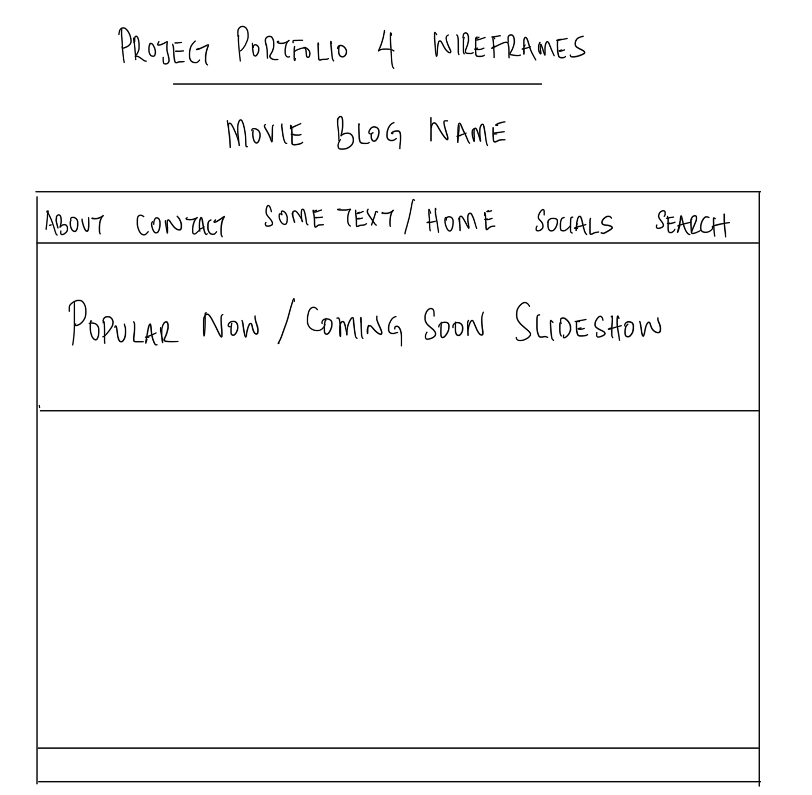 

### Database
 
This project uses PostgreSQL from Code Institute for storing the data.

### Agile
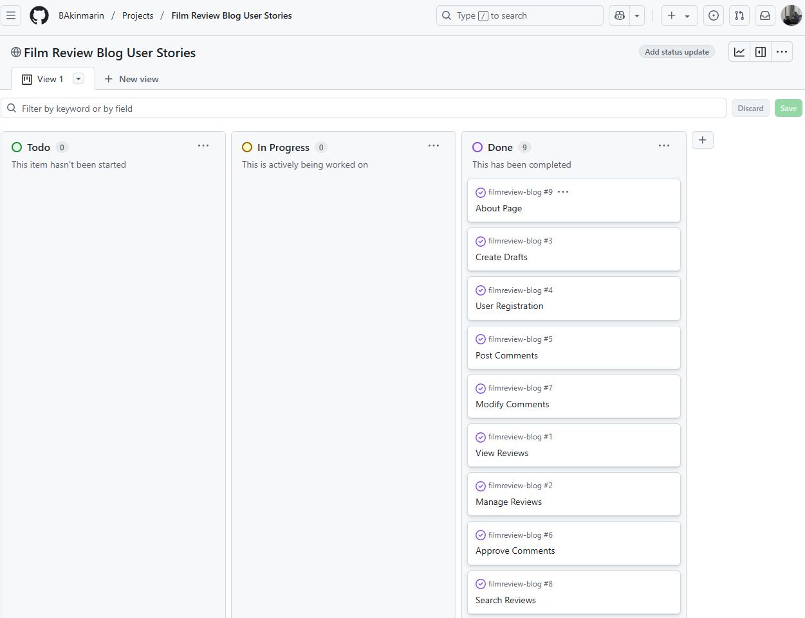 
This project was developed using Agile methodology. User Stories are accompanied by a set of Acceptance Criteria and Tasks, helping to define and test functionality.

[Back to Top](#ux)

## [Surface](surface)
### Colour Palette
The colours used in this project was inspired by what they symbolise:
- Green - #004643 - known for its calming and soothing effect on the eyes and mind.
- Ivory - #FDFBED - known for sophistication, evokes feelings of tranquility.

### Typography
The font used in this project was inspired by a desire to use an uncommon font without detracting from its readability. After a brief search on Google, the following Google Fonts imports were used:
- 'Federo' as the main font for all text
- 'Sans-Serif' as the default in case 'Federo' fails
- 'Fira Mono' as the post-subtitle text containing author, date and time stamp

[Back to Top](#ux)

## Features
### Navigation
 
- This project includes a fully responsive navigation bar on all pages and consists of links to the various pages listed on the left side of the Blog Name, which doubles up as a Logo. There is also a fully functional 'Search Bar' for quick access to specific film reviews.

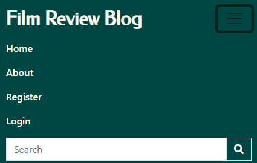 
- On smaller devices, the navigation bar is a burger icon, providing easy transition between various pages without the need of the 'Back' browser button. Clicking the Blog Name / Logo also takes the user to the 'Home Page' from anywhere in the Blog.

### Landing
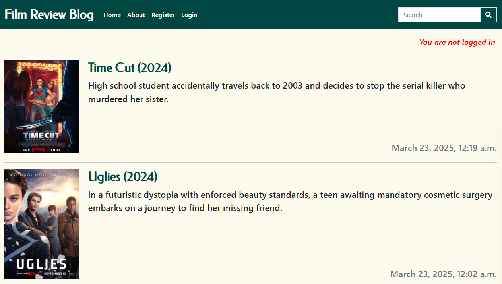 
- The landing page opens with a clear delivery of the purpose of the blogsite - with a display of a maximum of 6 reviews, showing the title, a cover photo and excerpt.

- Additionally, there is a login status at the top right corner of the blogsite letting the user know if they are logged in or not.

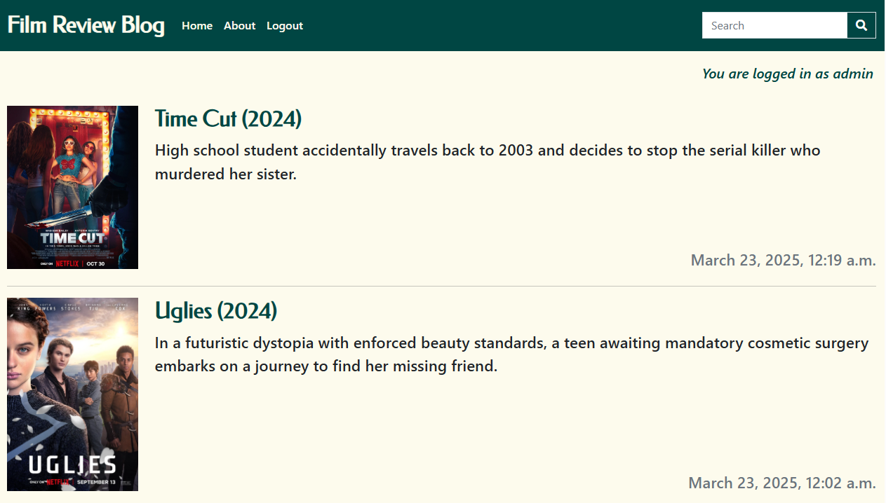 
- If not logged in, they see the first image above with the message "You are not logged in" displayed in red. Alternatively, they see a message "You are logged in as (username)" displayed immediately above this text.

### Posts
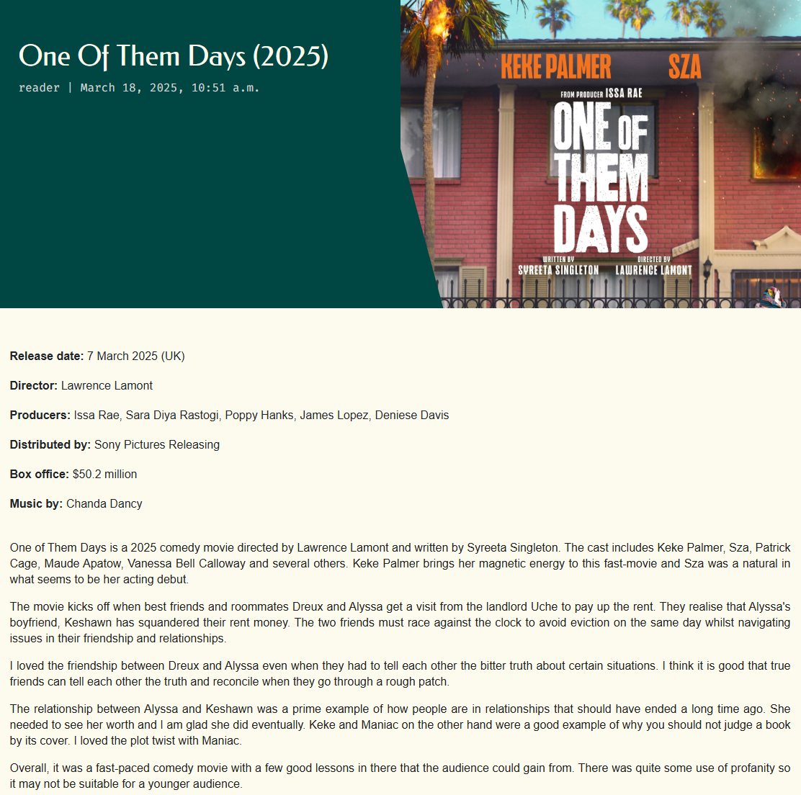 
- To encourage users to engage with content, they are able to view posts details without the need to register or login.

### Comments
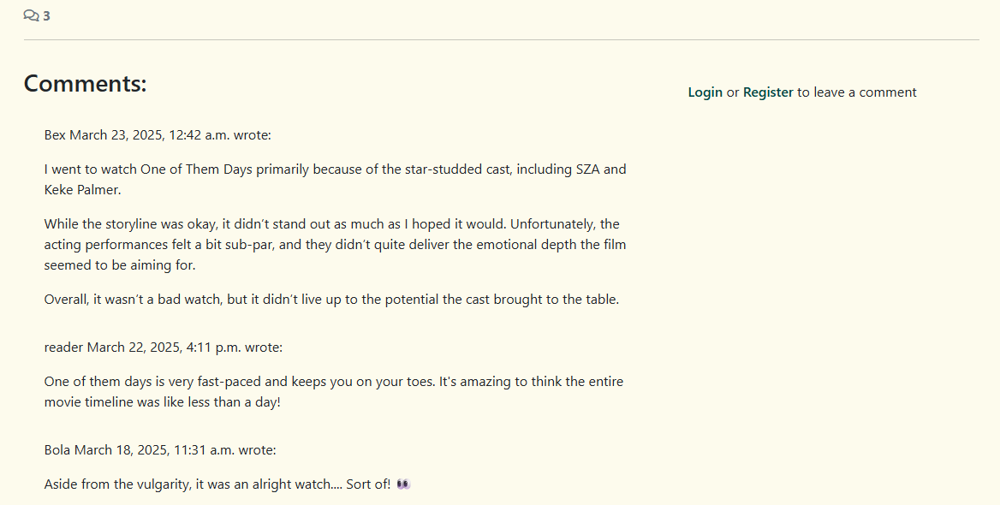 
- To encourage users to engage with content, they are able to view comments and without the need to register or login. However, they are unable to comment or interact with existing comments if they are not registered and signed in. The above image shows the comments view withcomment count for a user that isn't logged in.

- The comments view also displays the number of comments on a post.

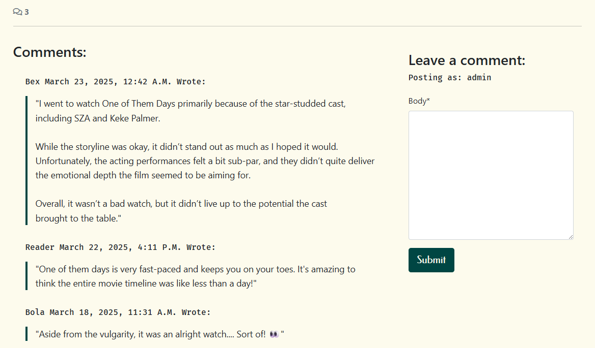 
- The above image shows the comments view and comment count for a user that is registered and logged in.

### Register
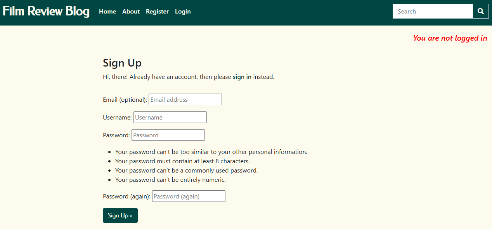 
- The blogsite offers users the option to register for full access to the site's functionality.

### Login
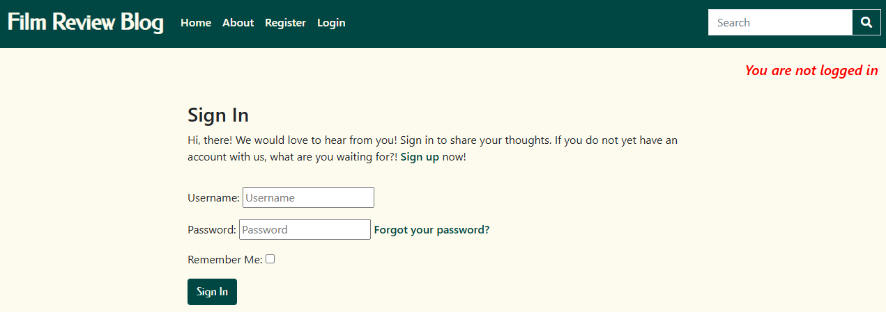 
- The blogsite offers returning users the option to login to continue with access to the site's functionality.

### About

[Back to Top](#ux)

## Future Features
- Enhance interaction with posts and comments by introducing a 'Like' button.

[Back to Top](#ux)

## Technologies

<table>
  <tr>
    <td valign="top">
      <table>
        <tr>
          <td><strong>Back End</strong></td>
          <td style="text-align:right;">Django 5.1.1 <code>Django==5.1.1</code></td>
        </tr>
        <tr>
          <td><strong>Database</strong></td>
          <td style="text-align:right;">PostgreSQL <code>psycopg2==2.9.10</code></td>
        </tr>
        <tr>
          <td><strong>Authentication</strong></td>
          <td style="text-align:right;">Django Allauth <code>django-allauth==65.5.0</code></td>
        </tr>
        <tr>
          <td><strong>Frontend</strong></td>
          <td style="text-align:right;">JavaScript, JSON, HTML5, CSS3</td>
        </tr>
        <tr>
          <td><strong>Styling</strong></td>
          <td style="text-align:right;">Crispy Forms | Bootstrap5 <code>crispy-bootstrap5==2024.10</code></td>
        </tr>
        <tr>
          <td><strong>Media Storage</strong></td>
          <td style="text-align:right;">Cloudinary <code>cloudinary==1.43.0</code></td>
        </tr>
        <tr>
          <td><strong>Static Files</strong></td>
          <td style="text-align:right;">Whitenoise <code>whitenoise==6.9.0</code></td>
        </tr>
        <tr>
          <td><strong>Server</strong></td>
          <td style="text-align:right;">Gunicorn <code>gunicorn==23.0.0</code></td>
        </tr>
        <tr>
          <td><strong>Image Handling</strong></td>
          <td style="text-align:right;">Pillow <code>pillow==11.1.0</code></td>
        </tr>
      </table>
    </td>
    <td valign="top" style="padding-left: 20px;">
      <h3>Other Dependencies</h3>
      <ul style="list-style-type: none; padding-left: 0;">
        <li><code>sqlparse==0.5.3</code></li>
        <li><code>asgiref==3.8.1</code></li>
        <li><code>packaging==24.2</code></li>
        <li><code>setuptools==76.0.0</code></li>
        <li><code>oauthlib==3.2.2</code></li>
        <li><code>typing_extensions==4.12.2</code></li>
        <li><code>tzdata==2025.1</code></li>
        <li><code>django-summernote==0.8.20.0</code></li>
      </ul>
    </td>
  </tr>
</table>

[Back to Top](#ux)

### Tools

- [GitHub](https://github.com/): Used to host source code and version control.
- [VSCode](https://code.visualstudio.com/): Used as Integrated Development Environment (IDE).
- [Heroku](https://www.heroku.com/): Used for deploying the project.
- [Font Awesome](https://fontawesome.com/): Source of icons used in this project.
- [Unicode Emoji Characters](https://unicode.org/emoji/charts/full-emoji-list.html): Source of emojis.
- [Coolors](https://coolors.co/): Used to generate color palette.
- [Convertio](https://convertio.co/): Used to compress images used in project for optimal load times.
- [Favicon](https://favicon.io/): Used to generate favicon for project.
- [drawSQL](https://drawsql.app/): Used to create the Entity Relationship Diagram (ERD).
- [Google Font](https://fonts.google.com/): Used for the typography used in the project.
- [Bootstrap4](https://getbootstrap.com/): Used for base styling of the blog.
- [Cloudinary](https://cloudinary.com/): Used for storing static files.
- [Chrome Developer Tools](https://developer.chrome.com/docs/devtools/): Used to debug project.
- [PostgreSQL from Code Institute](https://dbs.ci-dbs.net/): Used to create database.
- [Code Institute Python Linter](https://pep8ci.herokuapp.com/): Used to validate Python.
- [W3C HTML Validator](https://validator.w3.org/): Used to validate HTML.
- [W3C CSS Validator](https://jigsaw.w3.org/css-validator/#validate_by_uri): Used to validate CSS.
- [Google Lighthouse](https://developer.chrome.com/docs/lighthouse/overview/): Used to test performance.

## Packages
- [Django](https://www.djangoproject.com/) was used as the framework for the blog.
- [Allauth](https://django-allauth.readthedocs.io/) for the login authentication.
- [Crispy Forms](https://django-crispy-forms.readthedocs.io/) for collecting and posting comments.
- [Cloudinary](https://cloudinary.com/) for hosting the images.
- [Gunicorn](https://gunicorn.org/) for handling the HTTP requests in production.
- [Psycopg2](https://www.psycopg.org/) for aiding communication between Django and PostgresSQL.
- [Formtools](https://django-formtools.readthedocs.io/) for additional form utilities.
- [Whitenoise](https://whitenoise.readthedocs.io/en/stable/) for deploying static files to Heroku.

[Back to Top](#ux)

## Testing

### User Testing - Manual

    
Experience

    

        

            <table style="margin: 0 auto; border-collapse: collapse; width: 100%;">
                <tr>
                    <th>Test</th>
                    <th>Expectation</th>
                    <th>Outcome</th>
                </tr>
                <tr>
                    <td>User can click a post to view full content</td>
                    <td>Pass</td>
                    <td>Pass</td>
                </tr>
                <tr>
                    <td>User can comment on post</td>
                    <td>Pass</td>
                    <td>Pass</td>
                </tr>
                <tr>
                    <td>User can edit previous post</td>
                    <td>Pass</td>
                    <td>Pass</td>
                </tr>
                <tr>
                    <td>User can delete previous post</td>
                    <td>Pass</td>
                    <td>Pass</td>
                </tr>
                <tr>
                    <td>User can submit request to owner to review a specific film</td>
                    <td>Pass</td>
                    <td>Pass</td>
                </tr>
                <tr>
                    <td>User receives message to confirm status of all activities on site</td>
                    <td>Pass</td>
                    <td>Pass</td>
                </tr>
            </table>
        

    

    
Navigation

    

        

            <table style="margin: 0 auto; border-collapse: collapse; width: 100%;">
                <tr>
                    <th>Test</th>
                    <th>Expectation</th>
                    <th>Outcome</th>
                </tr>
                <tr>
                    <td>Navigation links lead to their intended pages</td>
                    <td>Pass</td>
                    <td>Pass</td>
                </tr>
                <tr>
                    <td>User can browse content without signing in</td>
                    <td>Pass</td>
                    <td>Pass</td>
                </tr>
                <tr>
                    <td>User can navigate to home page at any time by clicking Logo or Home</td>
                    <td>Pass</td>
                    <td>Pass</td>
                </tr>
                <tr>
                    <td>User is aware of where they are on the blogsite via navigation links</td>
                    <td>Pass</td>
                    <td>Pass</td>
                </tr>
                <tr>
                    <td>User can navigate to about page to view more information about the blog</td>
                    <td>Pass</td>
                    <td>Pass</td>
                </tr>
                <tr>
                    <td>User can search blogsite for a specific film and view results of search criteria</td>
                    <td>Pass</td>
                    <td>Pass</td>
                </tr>
                <tr>
                    <td>User is shown error message if they hit search without entering a search criteria</td>
                    <td>Pass</td>
                    <td>Pass</td>
                </tr>
            </table>
        

    

    
Registration

    

        

            <table style="margin: 0 auto; border-collapse: collapse; width: 100%;">
                <tr>
                    <th>Test</th>
                    <th>Expectation</th>
                    <th>Outcome</th>
                </tr>
                <tr>
                    <td>User can create an account on the blogsite</td>
                    <td>Pass</td>
                    <td>Pass</td>
                </tr>
                <tr>
                    <td>User can login to existing account</td>
                    <td>Pass</td>
                    <td>Pass</td>
                </tr>
                <tr>
                    <td>User is informed once account has successfully been created</td>
                    <td>Pass</td>
                    <td>Pass</td>
                </tr>
            </table>
        

    

    
Responsiveness

    

        

            <table style="margin: 0 auto; border-collapse: collapse; width: 100%;">
                <tr>
                    <th>Test</th>
                    <th>Expectation</th>
                    <th>Outcome</th>
                </tr>
                <tr>
                    <td>Home, about, register and login pages display correctly on mobiles and tablets (769px and lower)</td>
                    <td>Pass</td>
                    <td>Pass</td>
                </tr>
                <tr>
                    <td>Home, about, register, and login pages display correctly on laptops and desktops (992px and higher - up to 1200px)</td>
                    <td>Pass</td>
                    <td>Pass</td>
                </tr>
                <tr>
                    <td>Photos associated with posts are hidden on smaller devices when clicked into</td>
                    <td>Pass</td>
                    <td>Pass</td>
                </tr>
                <tr>
                    <td>Content on about page is layered when viewed on smaller devices</td>
                    <td>Pass</td>
                    <td>Pass</td>
                </tr>
            </table>
        

    

[Back to Top](#ux)

### Code Validation

#### CSS
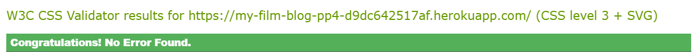 

#### HTML
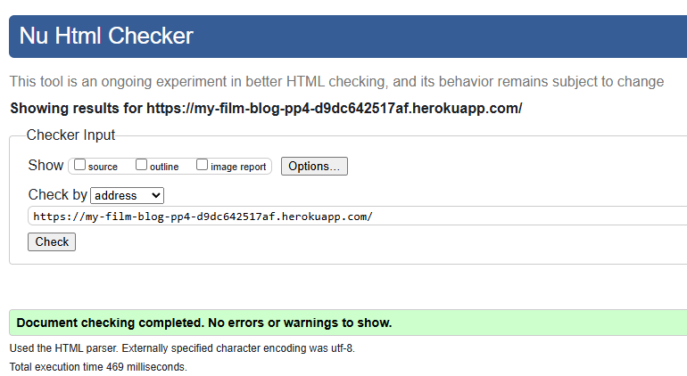 

#### Python
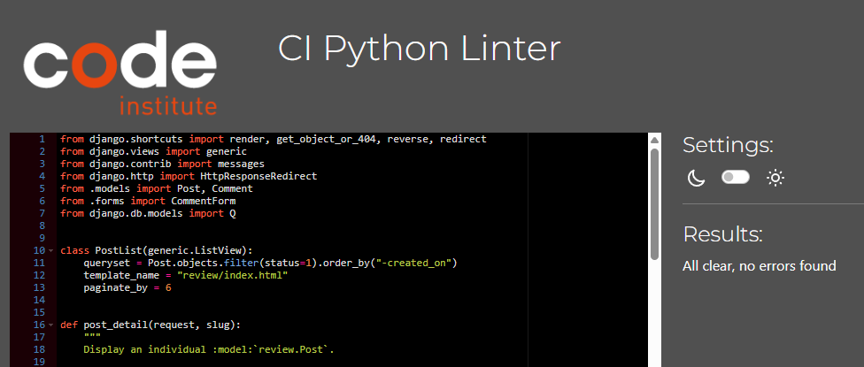 

[Back to Top](#ux)

### Google Lighthouse
#### Landing Page
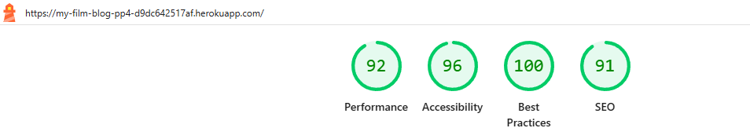 

#### Sign Up Page
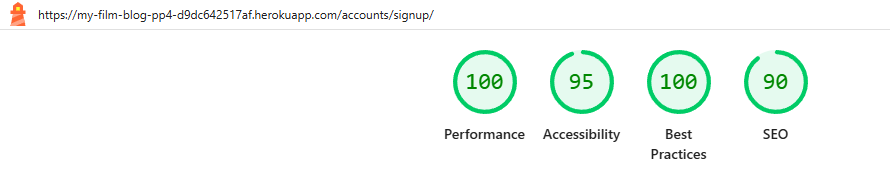 

#### Login Page
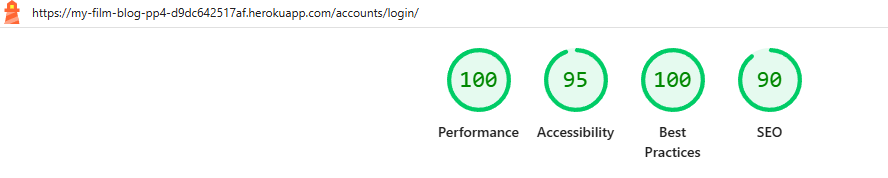 

#### About Page
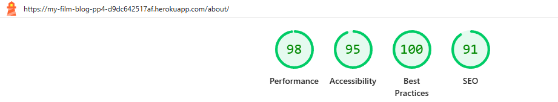 

[Back to Top](#ux)

## Bugs

    
Development Phase

    

        

            <table style="margin: 0 auto; border-collapse: collapse; width: 100%;">
                <tr>
                    <th>Bug</th>
                    <th>Action</th>
                    <th>Outcome</th>
                </tr>
                <tr>
                    <td>Application Error in Heroku [H10]</td>
                    <td>Amended project name in the Procfile</td>
                    <td>Fixed</td>
                </tr>
                <tr>
                    <td>Virtual Environment Pushed to GitHub</td>
                    <td>Deleted using git rm command in terminal</td>
                    <td>Fixed</td>
                </tr>
                <tr>
                    <td>Summernote 404 Error</td>
                    <td>Set DEBUG to True</td>
                    <td>Fixed</td>
                </tr>
                <tr>
                    <td>Search shows all reviews when no search criteria entered</td>
                    <td>Updated HTML and Python to include error message</td>
                    <td>Fixed</td>
                </tr>
            </table>
        

    

    
Deployment Phase

    

        

            <table style="margin: 0 auto; border-collapse: collapse; width: 100%;">
                <tr>
                    <th>Bug</th>
                    <th>Action</th>
                    <th>Outcome</th>
                </tr>
                <tr>
                    <td>Error loading Django template</td>
                    <td>Moved index.html to the correct directory and updated template_name</td>
                    <td>Fixed</td>
                </tr>
                <tr>
                    <td>Error loading static CSS</td>
                    <td>Set DEBUG to True</td>
                    <td>Fixed</td>
                </tr>
                <tr>
                    <td>Blog Images not loading to Heroku</td>
                    <td>Used Cloudinary to host media files</td>
                    <td>Fixed</td>
                </tr>
            </table>
        

    

[Back to Top](#ux)

## Deployment
### PostgreSQL from Code Institute
1. Navigate to [PostgreSQL from Code Institute](https://dbs.ci-dbs.net/)
2. Input your email address
3. Create a database
4. Receive database link
5. Copy Database URL to add to Heroku

[Back to Top](#ux)

### Cloudinary
1. Navigate to [Cloudinary](https://cloudinary.com/) and login.
2. Go to the Dashboard.
3. Copy the API Environment variable to add to Heroku.

[Back to Top](#ux)

### <code>settings.py</code>
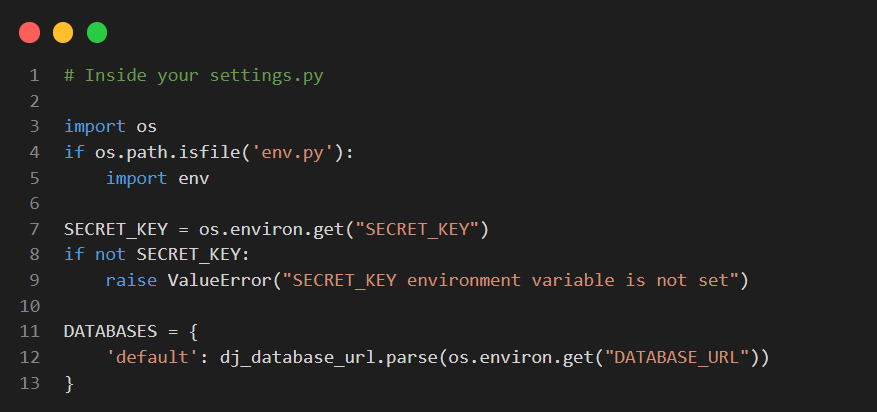 

### <code>env.py</code>
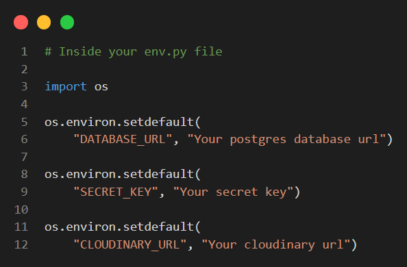 

### Heroku
1. In IDE: 
    - Use <code>pip3 freeze > requirements.txt</code> in command line to create requirements for Heroku.
    - Create a <code>.python-version</code> file with the Python version needed for Heroku to run project.
    - Create a <code>Procfile</code> and add <code>web: gunicorn [app name].wsgi</code> to file for Heroku.

2. Navigate to [Heroku](https://www.heroku.com/) and login.

3. Click "New" to create a new app.

4. Assign name to application, choose region and Click 'Create New App'.

5. On the next page click on the 'Settings' tab to adjust settings.

7. Click on 'Reveal Config Vars' and add the following keys:
    - ClOUDINARY_URL (from Cloudinary)
    - DATABASE_URL (from Code Institute PostgreSQL)
    - SECRET_KEY (from OS Environment Variable)
    - EMAIL_PASSWORD (generated by Yahoomail)

8. Navigate to the Deploy tab, click Connect to Github.

9. Search for repository, select it and click 'Connect'.

10. To deploy, choose one of the following options:
    - Automatic deploys - meaning Heroku will rebuild the app everytime a new change is pushed.
        - For this option, choose the branch to deploy and click 'Enable automatic deploys'. 
        - This can be changed to manual deployment at a later stage.
    - Manual deployment - which deploys current state of branch.

11. Click 'Deploy branch'.

12. Click 'Open App' to launch application.

[Back to Top](#ux)

### Forking
To create a copy of the repository in your account so you can modify independently, directly from GitHub:
- Click **Fork** in the top right of the repository page.
- A forked version of the project will appear in your own GitHub account.

[Back to Top](#ux)

## Credits

### [Content](#content)
- [Spencer's README](https://github.com/5pence/djangohelp/blob/main/readme.MD) was useful for setting up Django on my Windows machine.

- [Dimitris' README](https://github.com/Dimitris112/rum-away-testp4/blob/main/README.md) inspired the use of toggle view for tables.

- [Dan's README](https://github.com/DanMorriss/nialls-barbershop/blob/main/README.md) inspired some of the descriptions used in my write up.

- [StoriesOnBoard Blog](https://storiesonboard.com/blog/user-story-examples) inspired some of the language used in my User Stories write up.

- [Maria Pavlenko's Blog](https://www.altexsoft.com/blog/user-stories/) inspired some of the language used in my User Stories write u and template.

### [Media](#media)
- [Vintage Film Claper with Reel and Camera](https://depositphotos.com/photos/film.html?qview=210519084) used as default photo for posts.

- [Time Cut Photo](https://en.wikipedia.org/wiki/Time_Cut#/media/File:Time_Cut_film_poster.jpg) used as blog photo for Time Cut film review.

- [Uglies Photo](https://en.wikipedia.org/wiki/Uglies_(film)#/media/File:Uglies_film_poster.jpg) used as blog photo for Uglies film review.

- [Black Panther: Wakanda Forever Photo](https://musicart.xboxlive.com/7/687d6400-0000-0000-0000-000000000002/504/image.jpg) used as blog photo for Black Panther: Wakanda Forever film review.

- [Don't Worry Darling Photo](https://m.imdb.com/title/tt10731256/mediaviewer/rm973867777/) used as blog photo for Don't Worry Darling film review.

- [Mufasa: The Lion King Photo](https://m.media-amazon.com/images/M/MV5BYjBkOWUwODYtYWI3YS00N2I0LWEyYTktOTJjM2YzOTc3ZDNlXkEyXkFqcGc@._V1_UY1200_CR90,0,630,1200_AL_.jpg) used as blog photo for Mufasa: The Lion King film review.

- [One Of Them Days Photo](https://m.media-amazon.com/images/M/MV5BYjdhZDVkZDYtNDdlMC00MzcyLTgyYzgtNWUzODk4YTE2YWQ4XkEyXkFqcGc@._V1_.jpg) used as blog photo for One Of Them Days film review.

- [About Blog Photo](https://www.cinemaclock.com/movies/i-like-movies-2022) used as a cover photo for About page.

### [Code](#code)
- [Code Institute's Codestar Blog Walkthrough](https://github.com/Code-Institute-Solutions/blog) Project created in line with course content and within portfolio project 4 scope.

- [Ragas Imger's Stack Overflow Contribution](https://stackoverflow.com/questions/76558562/how-do-i-upload-a-picture-to-my-blog-using-the-django-administration) inspired the method used to render images directly through Django Administration.

- [Configuration Parameters](https://cloudinary.com/documentation/cloudinary_sdks#configuration_parameters) useful during testing to force Cloudinary to serve image URLs over HTTPS instead of HTTP.

- [Django Documentation - The Form Rendering API](https://docs.djangoproject.com/en/4.2/ref/forms/renderers/) useful for customising the Submit Film Request form layout.

[Back to Top](#ux)

## Acknowledgements

### Family
Thankful to God for my sister, Boluwatife Akinmarin and friend, Rebecca Wilson-Kane - who both contributed immensely towards the write up of reviews used in this project, as well as supporting with user testing and feedback on flow and experience.

### Spencer Barriball
My mentor who provided me with loads of tips and tricks to speed up the development of this project.

### Code Institute's Codestar Walkthrough Project
Special thanks to Code Institute's Matt and Neil who both delivered the learning material applied in the development of this project.

[Back to Top](#ux)